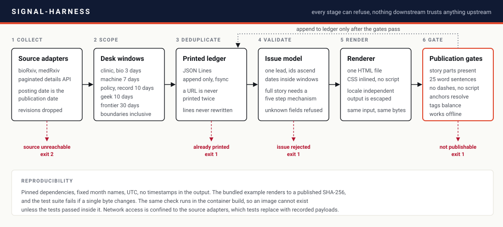

# signal-harness

A reproducible harness for a daily briefing on AI in medicine, biology and
health policy. It collects candidates from preprint servers, scopes them to
per-desk freshness windows, refuses anything already printed, validates the
issue against a strict schema, renders one self-contained HTML file and then
runs that file through publication gates before anything is recorded as
published.

The harness does not decide what is worth reading. That judgement stays with
the editor. What it does is make the mechanical part impossible to get
quietly wrong: an item outside its window, a story printed twice, a full story
missing its mechanism or its weakness, a broken anchor, a page that needs the
network to open.



## Quick start

Python 3.10 or newer.

```bash
python -m venv .venv && . .venv/bin/activate
pip install -r requirements.lock
pip install -e .
signal-harness demo -o build/demo.html
```

The last command renders the bundled example issue, runs every gate and
prints a SHA-256. On any machine, with the pinned dependencies, that hash is:

```
3d4b63c595138d0c80241b8b78ab56ddd138be6d4cab27b697f1188224c033d2
```

If yours differs, something in your environment is not what the lock file
says it should be. The test suite checks the same hash.

### With Docker

```bash
docker build -t signal-harness .
docker run --rm -v "$PWD/build:/work" signal-harness demo -o /work/demo.html
```

The image is built in two stages. The first stage installs the pinned
toolchain and runs lint, format checks, the full test suite with a coverage
floor and the demo. If any of those fail, there is no image. The runtime
stage carries only the package and its two runtime dependencies, and runs as
an unprivileged user.

If Docker Hub is not reachable from your network, point the build at any
Debian or Ubuntu based Python image you can pull:

```bash
docker build --build-arg BASE_IMAGE=registry.example.org/python:3.12-slim -t signal-harness .
```

## Commands

| Command | What it does | Exit codes |
|---|---|---|
| `signal-harness demo` | Render and gate the bundled example | 0 pass, 1 gate failure |
| `signal-harness render ISSUE.json -o OUT.html` | Validate and render one issue | 0, 1 if the issue is rejected |
| `signal-harness gate PAGE.html` | Run every publication gate on a rendered page | 0, 1 if any gate fails |
| `signal-harness ledger check ISSUE.json` | Report entries already printed | 0, 1 if any repeat |
| `signal-harness ledger append ISSUE.json` | Record an issue in the append-only ledger | 0 |
| `signal-harness hunt --source medrxiv --from D --to D` | List candidates from one source | 0, 2 if the source is unreachable |

`hunt` accepts `--match term ...` to filter by title and summary, and
`--recorded DIR` to replay saved responses instead of calling the network.

A typical daily run:

```bash
signal-harness hunt --source medrxiv --from 2026-10-04 --to 2026-10-07 \
    --match "language model" "deep learning" -o candidates.json
# editorial work happens here: read, verify at source, write issue.json
signal-harness ledger check issue.json
signal-harness render issue.json -o issues/2026-10-07.html
signal-harness gate issues/2026-10-07.html && signal-harness ledger append issue.json
```

The ledger is only extended after the gates pass, so a failed build never
marks anything as published.

## The issue format

An issue is one JSON document. The schema is enforced in
[`models.py`](src/signal_harness/models.py), and
[`issue.sample.json`](src/signal_harness/examples/issue.sample.json) is a
complete, valid example.

Each entry is a `lead`, a `story` or a `brief`. Leads and stories must carry
a mechanism box with five fixed parts:

| Field | Question it answers |
|---|---|
| `pieces` | What are the moving parts, described physically? |
| `normally_wrong` | What problem does this exist to solve, and how was it handled before? |
| `what_they_did` | What exactly was changed, added, removed or measured differently? |
| `numbers_mean` | What does each headline number count, and what does it not prove? |
| `anchor` | How does the mechanism connect to the reader's own work? |

Every entry needs a primary link, a real publication date inside its desk
window, a signal level (`WEAK`, `EARLY`, `SOLID` or `HARD`), a glossary and a
stated weakness. Unknown fields are rejected rather than ignored, so a typo
cannot silently drop content.

## Desk windows

A window of N days means nothing published before the issue date minus N
days. Both ends are inclusive.

| Desk | Window | Rationale |
|---|---|---|
| Clinic, Bio | 3 days | Preprint volume is high enough to fill a desk daily |
| Machine | 7 days | Releases cluster around a weekly rhythm |
| Policy, Off the Record, Geek Bench | 10 days | Regulatory and institutional news is slower |
| Frontier | 30 days | Multi-agent systems, quantum methods and digital twins rarely produce a printable result in a week |

For bioRxiv and medRxiv the posting date is the publication date. The
submission date, read from the DOI, is carried alongside it when the two
differ. A revision whose first version predates the window is not new, so
versions above one are dropped unless explicitly requested.

## Publication gates

Gates run against the rendered file, because the file is what a reader gets.

| Gate | Fails when |
|---|---|
| `story_parts` | A full story lacks any mechanism step, the plain-language box, the glossary, the weakness or the why-it-matters line |
| `contents` | The contents list is missing, split, links outside the page, or omits an entry |
| `sentence_length` | Any sentence inside an entry exceeds 25 words |
| `dashes` | An en or em dash appears in the text |
| `tag_balance` | Any structural tag is opened and closed a different number of times |
| `ids_and_anchors` | An id repeats, an anchor has no target, or story ids do not ascend |
| `sources` | An entry has no primary link, or the link is not HTTPS |
| `furniture` | A required section is missing or out of order |
| `no_script` | The page contains a script element |
| `offline` | The page references a remote stylesheet, font, image or CSS resource |

Each gate has a test that plants the exact fault it is meant to catch and
confirms that it fails.

## Development

```bash
make setup     # virtual environment with pinned dependencies
make check     # lint, format check, tests with coverage floor, demo
make docker    # build the image, which reruns the checks inside it
```

Tests never touch the network. Source adapters take a `Fetcher`, and the
tests pass a `RecordedFetcher` loaded from [`tests/data`](tests/data).
Coverage is enforced at 90 per cent.

### Reproducibility notes

- Dependencies are pinned in [`requirements.lock`](requirements.lock).
- Dates are formatted from fixed tables rather than `strftime`, which reads
  the process locale.
- The output contains no build time, host name or random value.
- The container sets `LC_ALL=C.UTF-8`, `TZ=UTC` and `SOURCE_DATE_EPOCH=0`.

## Layout

```
src/signal_harness/
  sources/      source adapters and the fetcher abstraction
  windows.py    per-desk freshness windows
  ledger.py     append-only record of everything printed
  models.py     the issue schema and its validation
  render.py     HTML rendering, deterministic and locale independent
  gates/        publication checks run on the rendered page
  templates/    the page template and its stylesheet
  examples/     a complete issue and its expected checksum
tests/          unit and end-to-end tests, recorded source payloads
docs/           architecture figure
```

## Contact

Bug reports, questions and security reports go in the
[issue tracker](https://github.com/a7med7emedan/signal-harness/issues). For
anything else, email Ahmed Hemedan at ahmed.hemedan@lih.lu.

## Licence

Apache License 2.0. See [LICENSE](LICENSE) and [NOTICE](NOTICE).
